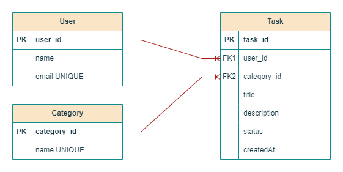

# Spring Boot Task Management API

## Overview
This is a simple Spring Boot REST API for managing tasks, users, and categories. The project uses an H2 in-memory database and provides CRUD (Create, Read, Update, Delete) operations for each entity.

## Entity-Relationship Diagram (ERD)
The application consists of three main entities:
- **User**: Represents a user who can have multiple tasks.
- **Task**: Represents a task assigned to a user and associated with a category.
- **Category**: Represents a category that can contain multiple tasks.

The relationships between entities:
- A **User** can have multiple **Tasks** (One-to-Many).
- A **Task** belongs to only one **User**.
- A **Category** can contain multiple **Tasks** (One-to-Many).
- A **Task** belongs to only one **Category**.



## Technologies Used
- **Spring Boot** (REST API)
- **Spring Data JPA** (Database interactions)
- **H2 Database** (In-memory database for development and testing)
- **Spring Boot Starter Web** (Building RESTful services)
- **Lombok** (Reduces boilerplate code)

## API Endpoints
### User Endpoints
- `POST /users` - Create a new user
- `GET /users/{id}` - Retrieve user by ID
- `GET /users` - Retrieve all users
- `PUT /users/{id}` - Update user details
- `DELETE /users/{id}` - Delete user

### Task Endpoints
- `POST /tasks` - Create a new task
- `GET /tasks/{id}` - Retrieve task by ID
- `GET /tasks` - Retrieve all tasks
- `PUT /tasks/{id}` - Update task details
- `DELETE /tasks/{id}` - Delete task

### Category Endpoints
- `POST /categories` - Create a new category
- `GET /categories/{id}` - Retrieve category by ID
- `GET /categories` - Retrieve all categories
- `PUT /categories/{id}` - Update category details
- `DELETE /categories/{id}` - Delete category

## How to Run
1. Clone the repository.
2. Open the project in your preferred IDE.
3. Run the application using:
   ```sh
   mvn spring-boot:run
   ```
4. The API will be available at `http://localhost:8080`.

## H2 Database Console
- URL: `http://localhost:8080/h2-console`
- JDBC URL: `jdbc:h2:mem:testdb`
- Username: `sa`
- Password: (leave blank)

